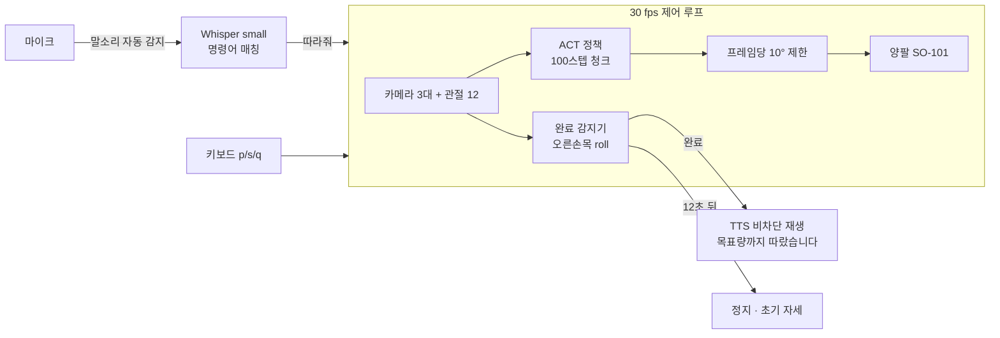
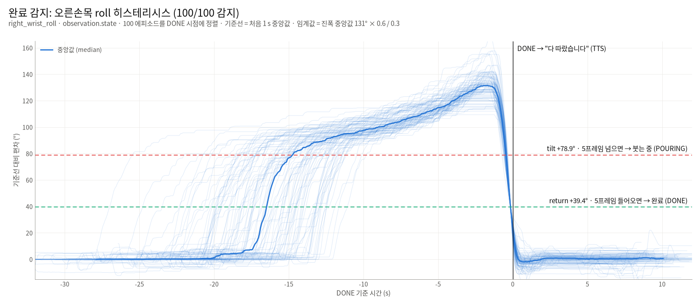

# 말하면 따라주는 손 — Voice-Commanded Bimanual Water Pouring

[](https://github.com/minsu1111111/lerobot_pac/actions/workflows/tests.yml)

**UNITA Manipulation (인천대학교)** · PAC 2026 피지컬 AI 챌린지 분과① 자율주제 선정작

"물 따라줘" 라고 말하면 양팔 로봇이 왼팔로 컵을 잡고 오른팔로 물통을 기울여 물을 따르고,
다 따르면 "목표량까지 따랐습니다" 라고 알려 준다. 로봇 동작은 사람 시연으로 학습한 정책(ACT)이 맡고,
음성 인식·완료 판단·안내·안전 장치는 정책 바깥에서 붙였다.

> **English summary.** A bimanual SO-101 robot (LeRobot `bi_so_follower`) pours water on a spoken Korean command.
> An ACT policy trained from 100 teleoperated demos drives both arms; around it we built Whisper-based voice
> command recognition (hands-free VAD), a joint-state completion detector (hysteresis on the pouring wrist,
> 100/100 on the dataset), non-blocking offline TTS, per-frame command clamping for safe chunk transitions,
> a MuJoCo bimanual digital twin for hardware-free testing, and an offline-ready launcher. 84 unit tests, CI.

<p align="center">
  
  <br><sub>시뮬 데모 (카메라 = 녹화된 시연 영상, 팔 = MuJoCo). 소리 포함 영상: <a href="docs/media/demo_sim.mp4">demo_sim.mp4</a></sub>
</p>

## 동작 흐름



한 프로그램(`run_demo.sh` → `rollout/pour_rollout.py`)이 대기 → 듣기 → 따르기 → 안내 → 대기를 반복한다.
로봇 백엔드는 셋 중 하나를 고른다: **real**(실제 로봇) · **replay**(녹화 데이터 재생) · **replay+mujoco**(녹화 영상 + MuJoCo 관절).

## 핵심 설계와 측정값

| 문제 | 해결 | 결과 |
|---|---|---|
| 언제 "다 따랐는지" 알기 (물이 투명해 비전 판정 불안정) | 붓는 팔 손목 roll 한 관절만 보고, 기울기 두 기준선(진입 78.9° / 복귀 39.4°) + 5프레임 유지로 히스테리시스 판정. 모델 재학습 불필요 | 데이터셋 **100/100**, 모델 출력(open-loop) **100/100**, 시연 대비 완료 시점 차이 중앙 0.07 s |
| ACT 가 100스텝마다 새 청크를 낼 때 명령이 튐 | 직전 명령 대비 **프레임당 10° 제한** (시연 데이터의 최대 변화 ≈ 10°) | open-loop 최대 69.8° → 10°. 정상 동작에서 제한이 걸리는 건 몇 프레임 |
| 안내 음성이 제어 루프를 막음 | 미리 만든 wav 를 백그라운드 스레드에서 재생, 실패하면 자막만 | `say()` 0.2 ms, 30 fps 루프 지연 0건 |
| 버튼 없이 말로 시작 | webrtcvad 말소리 감지 → Whisper(ko, 명령어 프롬프트) → 키워드 매칭, 정지 우선. 안내 음성 재생 중엔 듣지 않음(자기 목소리 오인 방지) | 합성 음성 122개 **98.4%**, 정지 누락 0, 오작동 따르기 0 (CPU 중앙 2.3 s) |
| 하드웨어 없이 전체 시험 | 공식 SO-101 MJCF 두 대로 양팔 디지털 트윈, 롤아웃의 가짜 로봇 백엔드 | closed-loop(관절)에서도 완료 감지 정상, 청크 경계 7° |
| 대회장은 인터넷이 없을 수 있음 | 오프라인 점검 스크립트, 정책 생성 시 ResNet 다운로드 차단(체크포인트가 덮어써 출력 동일) | 네트워크 차단 상태에서 전부 로드 확인 |

자세한 근거와 그래프: [`docs/DESIGN.md`](docs/DESIGN.md)

<p align="center"></p>

## 저장소 구조

`tts/` `stt/` `sim/` 은 **서로 import 하지 않는 독립 모듈**이다. 폴더 하나만 다른 프로젝트에 복사해도 돌고,
각자 README · requirements · tests 가 있다.

| 폴더 | 내용 |
|---|---|
| [`rollout/`](rollout/) | 데모 롤아웃 루프 — 정책 추론(LeRobot `SyncInferenceEngine` 과 같은 경로), 완료 감지, TTS·STT, 키보드 정지, 백엔드 3종 |
| [`tts/`](tts/) | 고정 문구 wav 비차단 재생 (edge-tts 로 미리 생성, 실행은 오프라인) |
| [`stt/`](stt/) | 음성 명령 인식 — 자동 감지/Enter 녹음, Whisper, 명령어 매칭, 인식률 시험·녹음 도구 |
| [`sim/`](sim/) | 양팔 SO-101 MuJoCo — 궤적 재생 영상, 롤아웃용 가짜 관절 로봇 |
| [`train/`](train/) | 데이터 수집(`lerobot-record` 양팔 래퍼), 학습(이어서 학습/처음부터), 체크포인트 검증 절차 |
| [`analysis/`](analysis/) | 관절 분석 → 완료 감지 임계값 (`--install` 로 `rollout/thresholds.json` 갱신) |
| [`validate/`](validate/) | 오프라인 모델 검증 — 데이터셋 프레임 → 모델 action → 감지기 |
| [`tools/`](tools/) | 오프라인 점검, 카메라 확인, TTS 루프 타이밍, 시뮬 영상 소리 입히기, 그림 생성 |
| `pour_detector.py` · `paths.py` · `run_demo.sh` | 완료 감지기 · 경로 · 단일 실행기 |

결과물·외부 파일은 저장소 밖 `~/UNITA_PAC2026/local/` (환경변수 `UNITA_LOCAL`) 에 둔다.

## 실행

LeRobot 0.6.1 (팀 포크 [Unita_lerobot](https://github.com/minsu1111111/Unita_lerobot), editable 설치) 환경에서:

```bash
pip install -r requirements.txt                 # 롤아웃 + stt + sim 의존성
python sim/fetch_so101.py                       # 공식 SO-101 MuJoCo 모델 (19 MB, 시뮬용)

bash run_demo.sh --replay                       # 하드웨어 없이: 녹화 데이터 재생
bash run_demo.sh --sim                          # 하드웨어 없이: 녹화 영상 + MuJoCo 관절
bash run_demo.sh                                # 실제 로봇 (robot.env 필요, rollout/robot.env.example)
python tools/offline_check.py --block-network   # 인터넷 없이 전부 로드되는지
```

조작: 대기 중 "물 따라줘" (또는 `p`+Enter) → 붓는 중 Space·`s` 즉시 정지, `q` 종료, Ctrl+C 안전 종료.

시뮬 데모 영상 만들기 (TTS 소리 자동 포함):

```bash
python rollout/pour_rollout.py --backend replay+mujoco --episode 25 --fast --auto-start --no-stt --no-tts \
    --sim-render offscreen --sim-video ~/UNITA_PAC2026/local/outputs/sim/rollout_ep25_sim.mp4
```

## 데이터와 모델

- 데이터셋 [`UNITAmanipulation/bi_so101_pour_water_20260920_194823`](https://huggingface.co/datasets/UNITAmanipulation/bi_so101_pour_water_20260920_194823) — 100 에피소드, 117,619 프레임, 30 fps, 카메라 3대(top 640×480, 손목 320×240), 상태·행동 12차원
- 모델 [`UNITAmanipulation/act_pour_water_100`](https://huggingface.co/UNITAmanipulation/act_pour_water_100) — ACT (ResNet18, chunk 100), 10만 스텝

## 현재 상태와 한계

- 위 측정은 **녹화 데이터 재생과 MuJoCo 시뮬**에서 한 것이다. 실제 로봇 백엔드는 LeRobot 소스에 맞춰 작성했지만
  하드웨어 검증 전이다.
- 대회용으로 손목 카메라 마운트와 그리퍼를 바꾸므로 정책은 현장에서 새로 수집·학습한다
  ([`train/`](train/), 준비 절차 [`docs/PREP_CHECKLIST.md`](docs/PREP_CHECKLIST.md)). 감지 임계값은 새 데이터에서 10초 만에 다시 계산한다.
- 모델 검증 100개는 학습에 쓴 데이터라 일반화 성능이 아니라 파이프라인 확인이다.
- 시뮬에는 액체가 없고 컵·물통은 단순 모형이다. 정책 입력 영상은 실제/녹화 카메라를 쓴다.

## 만든 것들

[LeRobot](https://github.com/huggingface/lerobot) · [MuJoCo](https://mujoco.org) ·
[SO-ARM100 SO-101 모델](https://github.com/TheRobotStudio/SO-ARM100) (Apache-2.0) ·
[Whisper](https://github.com/openai/whisper) · [webrtcvad](https://github.com/wiseman/py-webrtcvad) · [edge-tts](https://github.com/rany2/edge-tts)
