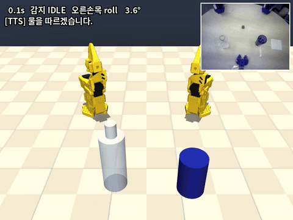
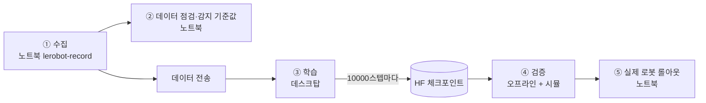
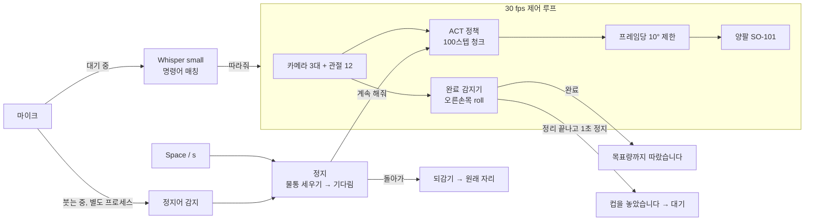

# 말하면 따라주는 손 — Voice-Commanded Bimanual Water Pouring

[](https://github.com/minsu1111111/lerobot_pac/actions/workflows/tests.yml)

**UNITA Manipulation (인천대학교)** · PAC 2026 피지컬 AI 챌린지 분과① 자율주제 선정작

"물 따라줘" 라고 말하면 양팔 로봇이 왼팔로 컵을 잡고 오른팔로 물통을 기울여 물을 따른 뒤,
컵을 내려놓고 알려 준다. 로봇 동작은 사람 시연으로 학습한 정책(ACT)이 맡고,
음성 인식·완료 판단·안내·정지·안전 복귀는 정책 바깥에서 붙였다.

> **English summary.** A bimanual SO-101 robot (LeRobot `bi_so_follower`) pours water on a spoken Korean command.
> An ACT policy trained from teleoperated demos drives both arms; around it we built Whisper voice commands
> (start, and stop while pouring), a joint-state completion detector (hysteresis on the pouring wrist, 100/100 on the
> dataset), non-blocking offline TTS, a stop routine that uprights the bottle and replays the executed path backwards,
> a MuJoCo bimanual digital twin for hardware-free testing, and an offline-ready launcher. 85 unit tests, CI.

<p align="center">
  
  <br><sub>시뮬 데모 (카메라 = 녹화된 시연 영상, 팔 = MuJoCo). 소리 포함 영상: <a href="docs/media/demo_sim.mp4">demo_sim.mp4</a></sub>
</p>

## 데모 시나리오

| 순서 | 사람 | 로봇 (안내 음성) |
|---|---|---|
| 1 | | "준비됐습니다. 말씀해 주세요." |
| 2 | **"물 따라줘"** | "물을 따르겠습니다." → 왼팔 컵 잡기, 오른팔 물통 잡기 |
| 3 | | 붓기 → 손목 각도로 완료 감지 → **"목표량까지 따랐습니다."** |
| 4 | | 컵을 지정 위치에 내려놓고 복귀 → **"컵을 놓았습니다. 맛있게 드세요."** → 다시 1 |
| 정지 | 붓는 중 **"정지" / "멈춰" / "그만"** 또는 Space | "정지했습니다. 돌아갈까요, 계속할까요?" → **물통 먼저 세우고 멈춰서 기다림** |
| 돌아가기 | 멈춘 상태에서 **"돌아가"** (Space·r) 또는 20초 동안 말 없음 | **지나온 길을 거꾸로 되돌아가 컵·물통을 제자리에** → "원래 자리로 돌아왔습니다." |
| 계속 | 멈춘 상태에서 **"계속 해줘"** / "이어서" / "따라줘" (c) | "이어서 따르겠습니다." → 정책이 지금 자세에서 다시 이어 붓기 |

물 양은 **물통에 목표량만 담아 두고 끝까지 따르는 방식**으로 맞춘다 (투명한 물은 카메라로 수위를 안정적으로 볼 수 없음).

## 대회 진행 방식 (10/9~10/10)

손목 카메라 마운트와 그리퍼가 바뀌므로 **현장에서 새로 수집하고 학습**한다. 노트북 한 대(GTX 1060)가 수집과 롤아웃을
모두 맡고, 학습은 연구실 데스크탑(RTX 5060)에 원격으로 맡긴다.



| 단계 | 어디서 | 할 일 | 명령 |
|---|---|---|---|
| ① 수집 | 노트북 | 텔레옵 시연 (물통 목표량 고정, 컵 놓는 위치 테이프 표시, 같은 속도) | [수집](#수집) |
| ② 점검 | 노트북 | 에피소드 수·길이 확인, 완료 감지 기준값 다시 계산 (10초) | `python analysis/joint_analysis.py --dataset <데이터> --install` |
| ③ 학습 | 데스크탑 | 기존 모델에서 이어서 학습, 10000스텝마다 HF 업로드 | [학습](#학습-데스크탑) |
| ④ 검증 | 노트북 | 학습 도는 동안 체크포인트를 받아 오프라인 검증 + 시뮬 | [검증](#체크포인트-검증) |
| ⑤ 실행 | 노트북 | **첫 시험은 "물 담고 붓는 중 정지 → 물이 멈추는지"**, 그다음 전체 시나리오 반복 | `bash run_demo.sh` |

모든 단계를 SSH 터미널(Tailscale)에서 할 수 있다. 끊김 대비로 `tmux` 안에서 실행할 것 (노트북에 없으면 `sudo apt install tmux`).

## 노트북 준비

```bash
conda activate lerobot-gpu          # 수집·롤아웃 모두 이 환경 (아래 이유)
cd ~/lerobot_pac
python tools/offline_check.py --block-network   # 인터넷 없이 모델·Whisper·마이크까지 전부 뜨는지
```

- **반드시 `lerobot-gpu`.** GTX 1060(Pascal)은 CUDA 12.6 빌드 torch(`2.11.0+cu126`)만 GPU 를 쓴다.
  `lerobot` env 는 cu130 빌드라 드라이버 535 에서 CUDA 가 안 돼 정책이 CPU 로 돌고, 청크마다 약 0.3 초씩 멈칫한다.
  `run_demo.sh` 와 `train/record.sh` 는 `lerobot-gpu` 가 있으면 자동으로 그쪽을 쓴다.
- 로봇 설정 한 파일을 수집·롤아웃이 같이 쓴다: `~/UNITA_PAC2026/local/robot.env` (없으면 `rollout/robot.env.example` 복사).
  포트·카메라 경로를 채운다. 카메라는 `/dev/videoN` 대신 `/dev/v4l/by-id/...` (재연결해도 안 바뀜).
  양팔 카메라 3대가 `REPLACE` 자리표시자로 남아 있으면 `run_demo.sh` 가 실행을 막는다. 한 팔 리허설은 `SINGLE_*` 항목.
- 디스크 여유 20 GB 이상 (수집 중 임시 이미지가 크다).
- **마이크 입력 볼륨을 너무 높이지 말 것.** 이 노트북은 캡처 100%(+30 dB)에서 신호가 잘려(클리핑) 짧은 정지어를 놓쳤다.
  `amixer -c 0 sset Capture 30` (48%) 에서 정상. 현장에서 마이크를 바꾸면 `python stt/voice_command.py --mode stream` 으로 먼저 확인.

## 실행 (롤아웃)

```bash
bash run_demo.sh                              # 실제 로봇
bash run_demo.sh --sim --sim-render window    # 하드웨어 없이: 녹화 영상 + MuJoCo 관절 (노트북 화면에 창)
bash run_demo.sh --replay                     # 하드웨어 없이: 녹화 데이터 그대로 재생
bash run_demo.sh --sim --policy <체크포인트 폴더> --dataset <데이터 폴더>   # 새 모델·새 데이터로
bash run_demo.sh --single --policy <한 팔 체크포인트> --thresholds <한 팔 임계값.json>   # 팔 한 대 리허설 (robot.env 의 SINGLE_*)
```

| 조작 | 대기 중 | 붓는 중 | 되감는 중 |
|---|---|---|---|
| 음성 | "물 따라줘" → 시작 | "정지·멈춰·그만" → 정지 → "돌아가" / "계속 해줘" | (듣지 않음) |
| 키보드 | `p`+Enter 시작, `q`+Enter 종료 | **Space / `s`** 정지 → Space·`r` 돌아가 / `c` 계속, `q` 종료 | **Space = 그 자리에서 즉시 멈춤 (비상)** |
| Ctrl+C | 종료 | 정지 절차 후 종료 | 즉시 멈춤 |

자주 쓰는 옵션 (뒤에 붙이면 `pour_rollout.py` 로 전달):

| 옵션 | 기본 | 언제 |
|---|---|---|
| `--stt-mode enter` | `stream` (최근 2초를 0.5초마다 받아써 바로 반응) | 음성이 계속 안 될 때 비상용. Enter → 말하기 → Enter |
| `--mic <번호>` | 시스템 기본 | 헤드셋 마이크 (`python stt/voice_command.py --list-devices`) |
| `--no-voice-stop` | 켜짐 | 붓는 중 음성 정지를 끄고 키보드만 |
| `--untilt-s 2.5` | 1.5 | 정지 때 물통을 세우며 물이 출렁이면 늘림 |
| `--rewind-speed 0.5` | 0.7 | 되감기가 빠르다 싶으면 낮춤 |
| `--stop-mode rewind` | `ask` | 정지하면 묻지 않고 바로 되감기 (`freeze` = 그 자리에서 멈춤) |
| `--pause-s 30` | 20 | 정지 뒤 "돌아가/계속"을 기다리는 시간 (지나면 되감기) |
| `--post-done-s` | 25 | 완료 뒤 정리 동작을 기다리는 최대 시간 |

## 동작 흐름



- **완료 감지**: 붓는 팔(오른팔) 손목 roll 이 기준 자세 대비 진입선(78.9°)을 넘었다가 복귀선(39.4°) 안으로 돌아오면 완료.
  ±180° 를 넘어가도 각도를 이어 붙여 계산한다(중간 완료 오판 방지). 기준선은 새 데이터로 `--install` 해서 갱신.
- **정상 종료**: 완료 뒤 정책이 컵을 내려놓고 시작 자세 근처(15° 이내)에서 팔·그리퍼가 1초 멈추면 끝 (최대 25초).
- **정지 절차** (붓기 완료 전): ① 오른손목이 15° 이상 기울어 있으면 기울이기 직전 자세로 1.5초에 세우고 멈춰서 "돌아가"/"계속"을
  기다림 ("계속" → 정책 이어서, 안내 음성이 나오는 동안은 마이크를 끔) → "돌아가" 면 ② 실제로 보냈던
  명령 경로를 거꾸로 0.7배속 재생 → 컵·물통은 집은 자리에 놓이고 그리퍼가 열림 → ③ 붓기 시작 때 관측한 자세로 0.5초에
  마무리 (정책의 첫 명령이 튀었어도 정확히 시작 자세로).
  관측값이 아니라 보냈던 명령을 되감는다 (관측값을 명령하면 쥔 그리퍼의 힘이 빠지고 무게로 처진 팔이 더 처진다).
  되감는 길에서 기울어 있던(붓던) 프레임은 건너뛰어 다시 기울이지 않는다 ("계속" 뒤 다시 멈춘 경우 등).
  붓기 완료 뒤 정지는 되감지 않고 그 자리에서 멈춘다 (되감으면 내려놓은 컵을 다시 집어 온다).
- **붓는 중 음성 정지**: 별도 프로세스에서 최근 2초를 0.5초마다 Whisper 로 확인한다 (제어 루프를 막지 않게). 정지어만 보며,
  잘못 알아들어도 멈추는 쪽이라 안전. 소음이 계속돼도 말 끝을 기다리지 않아 반응이 1초 안팎. 정책 추론은 소음 속에서 청크당 최대 77 ms (끄면 43 ms).

## 핵심 설계와 측정값

| 문제 | 해결 | 결과 |
|---|---|---|
| 언제 "다 따랐는지" 알기 (물이 투명해 비전 판정 불안정) | 붓는 팔 손목 roll 한 관절, 두 기준선 + 5프레임 유지 히스테리시스. 모델 재학습 불필요 | 데이터셋 **100/100**, 모델 출력(open-loop) **100/100**, 완료 시점 차이 중앙 0.07 s |
| 정지했는데 기울어진 물통에서 물이 계속 나옴 | 물통 먼저 세우기 + 지나온 명령 경로 되감기 | 시뮬: 붓는 중 어느 시점에 멈춰도 물통 1.5 s 안에 세움. **양팔 시뮬**(정지 시점 4곳): 컵·물통이 처음 자리 0.3 cm 이내, 끝 자세 오차 ≤1.3°. **실제 follower1**: 손목 세우기 1.75 s, 되감기 명령 프레임당 최대 1.8°, 시작 자세 오차 ≤0.7° |
| 붓는 중 손을 쓸 수 없는 사용자 | 별도 프로세스 음성 정지. 최근 2 s 를 0.5 s 마다 확인(겹치는 창), 마이크는 별도 스레드로 계속 읽음, 정지용은 Whisper 힌트 문장 끔 | **실제 follower1** 이 움직이는 중 스피커→마이크: 정지어 시작부터 0.7~1.4 s 에 정지 (조용함·분홍 잡음 모두). 말 끝을 기다리던 방식은 소음에서 4.3 s 또는 놓침 |
| ACT 가 100스텝마다 새 청크를 낼 때 명령이 튐 | 직전 명령 대비 **프레임당 10° 제한** | open-loop 최대 69.8° → 10° |
| 안내 음성이 제어 루프를 막음 | 미리 만든 wav 를 백그라운드 스레드에서 재생 | `say()` 0.2 ms, 30 fps 루프 지연 0건 |
| 말로 시작 | 붓는 중 정지와 같은 겹치는 창(`--stt-mode stream`): 최근 2 s 를 0.5 s 마다 Whisper 로 받아씀. 시작은 2번 연속 들려야 반응(환각 한 번에 로봇이 움직이지 않게) | 롤아웃 시뮬에서 "물 따라줘" 재생 시작부터 **1.8 s** 에 시작 (조용함·잡음). 예전 '말 끝까지 녹음' 방식은 노트북 소음에서 매번 **10 s**. 합성 음성 122개 98.4%, GTX 1060 인식 0.3 s |
| 하드웨어 없이 전체 시험 | 공식 SO-101 MJCF 두 대로 양팔 디지털 트윈, 한 팔 모드는 MuJoCo 로 움직이는 가짜 팔 | 정상 종료·정지·되감기·시간 초과·음성 정지, 한 팔 모드 경로 확인 |
| 대회장은 인터넷이 없을 수 있음 | 오프라인 점검, ResNet 다운로드 차단, wav 미리 생성 | 네트워크 차단 상태에서 전부 로드 확인 |

자세한 근거와 그래프: [`docs/DESIGN.md`](docs/DESIGN.md)

## 수집

평소처럼 `lerobot-record` 를 쓴다 (`conda activate lerobot-gpu` 먼저). 실행 폴더는 상관없다 — 데이터는
`~/.cache/huggingface/lerobot/<REPO_ID>` 에, 캘리브레이션은 `~/.cache/huggingface/lerobot/calibration` 에서 읽는다.
같은 설정을 `robot.env` 에서 읽어 주는 래퍼도 있다:

```bash
FOURCC=MJPG EP_S=120 RESET_S=90 NUM=50 REPO_ID=UNITAmanipulation/<이름> bash train/record.sh --play_sounds=true
# DRY_RUN=1 을 앞에 붙이면 명령만 출력, RESUME=1 이면 끊긴 수집 이어서
```

- 녹화 중 키: → 다음 에피소드, ← 다시 녹화, Esc 중단. **SSH 에서도 터미널 키로 된다** (팀 포크 `keyboard_input.py`).
  단 SSH 에서 `DISPLAY=:0` 을 주면 노트북 본체 키보드만 듣게 되니 비워 둘 것.
- 리셋 시간은 넉넉히 (컵 비우기·물통 채우기·원위치). 카메라 3대는 `MJPG` 권장 (USB 대역폭).
- 시연 규칙을 모든 에피소드에서 똑같이: 물통 양, 컵 놓는 위치, 속도. 실패한 에피소드 번호는 적어 둔다.

## 학습 (데스크탑)

[`train/train.sh`](train/train.sh) — 기본은 기존 모델 `act_pour_water_100` 에서 이어서 학습 (`MODE=finetune`).
뒤에 붙인 인자는 `lerobot-train` 으로 그대로 간다. 10000스텝마다 HF 에 체크포인트를 올리려면:

```bash
REPO_ID=UNITAmanipulation/<데이터> DATASET_ROOT=<데이터 폴더> STEPS=50000 SAVE_FREQ=10000 \
bash train/train.sh --save_checkpoint_to_hub=true --policy.repo_id=UNITAmanipulation/<새 모델 이름> --policy.private=true
```

- **`--policy.repo_id` 는 반드시 새 이름.** 이어서 학습은 원래 모델 설정(repo_id=`act_pour_water_100`)을 물려받으므로,
  안 주면 원래 모델 repo 에 올라간다.
- `<새 모델 이름>/checkpoints/010000/`, `020000/` … 으로 올라가고 같은 이름의 태그가 붙는다 (팀 포크 기능).
  올리는 동안(약 600 MB/회) 학습이 잠깐 멈춘다. 데스크탑에 HF 쓰기 권한 계정으로 로그인돼 있어야 한다.

## 체크포인트 검증

노트북에서 원하는 스텝의 `pretrained_model` 만 받는다 (약 200 MB):

```bash
python -c "from huggingface_hub import snapshot_download as d; \
d('UNITAmanipulation/<새 모델 이름>', allow_patterns='checkpoints/010000/pretrained_model/*', \
  local_dir='$HOME/UNITA_PAC2026/local/checkpoints/<새 모델 이름>')"
CKPT=~/UNITA_PAC2026/local/checkpoints/<새 모델 이름>/checkpoints/010000/pretrained_model
DATA=~/.cache/huggingface/lerobot/UNITAmanipulation/<데이터>

python validate/offline_model.py --model $CKPT --dataset $DATA --episodes 0 10 20 30 40   # 모델 출력 + 완료 감지
bash run_demo.sh --sim --sim-render window --policy $CKPT --dataset $DATA --episode 0      # 시뮬에서 정상 종료·정지·되감기
```

시뮬은 영상이 녹화본이라 **모델이 실제로 성공하는지는 알 수 없다** (관절·흐름 확인용). 성공 여부는 실제 로봇으로만 확인된다.
Tailscale 로 데스크탑에서 직접 가져오는 방법은 [`train/fetch_checkpoint.sh`](train/fetch_checkpoint.sh).

## 한 팔 리허설 (대회 전 파이프라인 연습)

팔 한 대(follower1)를 붓는 팔로 써서 수집 → 학습 → 롤아웃(음성 정지·되감기 포함)을 미리 한 번 돌려 본다.

1. **수집**: `lerobot-record --robot.type=so101_follower --robot.port=/dev/follower1 --robot.id=follower1` 에 카메라 `top`·`wrist`
   (robot.env 의 `SINGLE_TOP_CAM`·`SINGLE_WRIST_CAM`, 640×480·320×240, MJPG), 리더 하나, `--dataset.push_to_hub=true --dataset.private=true`.
   컵 위치를 표시하고 25~30개. 매번: 시작 자세 → 컵 들기 → 80° 이상 기울여 1초 → 되돌리기 → 같은 자리에 놓기 → 시작 자세.
2. **학습** (데스크탑): `lerobot-train --policy.type=act --dataset.repo_id=<데이터> --save_freq=5000 --save_checkpoint_to_hub=true --policy.repo_id=<새 이름> --policy.private=true ...`
3. **기준값** (노트북, 기본 `thresholds.json` 은 건드리지 않음):
   `python analysis/joint_analysis.py --dataset <데이터 폴더> --joint wrist_roll.pos --out ~/UNITA_PAC2026/local/outputs/single_th`
4. **시뮬 (모델 오기 전)**: 수집한 데이터를 그대로 시뮬로 재생해 감지·TTS·정착·정지/되감기를 먼저 확인.
   `--policy demo` = 데이터셋 action 재생(모델 대신), 체크포인트가 오면 `--policy <체크포인트>` 로 바꾼다.
   `--dataset` 가 한 팔 데이터셋이면 자동으로 오른팔 자리에 끼운다 (왼팔 고정, 시뮬의 오른손 소품 = 컵).
   ```bash
   bash run_demo.sh --sim --dataset <데이터 폴더> --episode 0 --policy demo \
     --thresholds ~/UNITA_PAC2026/local/outputs/single_th/summary.json --timeout-s 40 --home-tol-deg 25 \
     --auto-start --no-stt --test-stop-at 14 --sim-render window   # 14초에 정지 → 되감기
   ```
5. **롤아웃**: `bash run_demo.sh --single --policy <체크포인트> --thresholds ~/UNITA_PAC2026/local/outputs/single_th/summary.json --timeout-s 40 --home-tol-deg 25`
   → 붓는 중 "멈춰" 로 정지·되감기 확인.
   `--home-tol-deg 25`: 리허설 데이터 50개 중 3개가 손목 꺾임 17~21° 차이로 끝나 기본 15° 로는 "놓았습니다" 대신 시간초과로 끝남.
   25° 로 50/50 정착, 모두 에피소드 끝 1.5초 이내 (중간에 일찍 끝난 것 없음, 시뮬 `--policy demo`).
   붓지 못하고(기울기 부족 등) 빈 손으로 시작 자세에 돌아와 1초 멈추면 거기서 끝난다 (`no_pour`, 되감기 없음).
   되감기는 마지막으로 빈 손·시작 자세였던 곳까지만 (실제 60k 실패 1회: 40s 계속 + 되감기 59s → 26.5s 종료, 되감기 20s).

대회 당일도 같은 순서다: 수집 → 기준값 → 시뮬(`--policy demo`) → 체크포인트로 시뮬 → 하드웨어.

## 시험 도구

| 명령 | 용도 |
|---|---|
| `python tts/tts_player.py` | 안내 음성 8개 재생 |
| `python stt/voice_command.py --mode stream --stt-device cuda` | 명령 인식만 시험 ("물 따라줘" → pour, "정지" → stop) |
| `python tools/teleop_pour_check.py` | **팔 한 대**(follower1)로 완료 감지·TTS·STT 시험. 리더 없으면 손으로, `--leader-port` 로 텔레옵 |
| `python tools/camera_check.py list` | 카메라 경로·해상도 확인 (`focus`, `capture`, `compare` 도 있음) |
| `python tools/offline_check.py --block-network` | 인터넷 없이 전부 로드되는지 |

## 저장소 구조

`tts/` `stt/` `sim/` 은 **서로 import 하지 않는 독립 모듈**이다 (각자 README · requirements · tests).

| 폴더 | 내용 |
|---|---|
| [`rollout/`](rollout/) | 데모 롤아웃 루프(`pour_rollout.py`) — 정책 추론, 완료 감지, 정지·되감기, TTS·STT, 백엔드 4종(`backends.py`: real·replay·replay+mujoco·single), 붓는 중 음성 정지(`voice_stop.py`) |
| [`tts/`](tts/) | 고정 문구 wav 비차단 재생. 문구는 `tts/phrases.py`, 바꾸면 `python tts/generate_wavs.py` (인터넷 필요) |
| [`stt/`](stt/) | 음성 명령 인식 — 자동 감지/Enter 녹음, Whisper, 명령어 매칭, 인식률 시험·녹음 도구 |
| [`sim/`](sim/) | 양팔 SO-101 MuJoCo — 궤적 재생 영상, 롤아웃용 가짜 관절 로봇 |
| [`train/`](train/) | 수집 래퍼(`record.sh`), 학습(`train.sh`), 체크포인트 가져오기 |
| [`analysis/`](analysis/) | 관절 분석 → 완료 감지 기준값 (`--install` 로 `rollout/thresholds.json` 갱신) |
| [`validate/`](validate/) | 오프라인 모델 검증 — 데이터셋 프레임 → 모델 action → 감지기 |
| [`tools/`](tools/) | 오프라인 점검, 카메라 확인, 팔 한 대 시험, TTS 루프 타이밍, 그림 생성 |
| `pour_detector.py` · `paths.py` · `run_demo.sh` | 완료 감지기 · 경로 · 단일 실행기 |

결과물·로그는 저장소 밖 `~/UNITA_PAC2026/local/` (환경변수 `UNITA_LOCAL`) 에 쌓인다.

## 데이터와 모델

- 데이터셋 [`UNITAmanipulation/bi_so101_pour_water_20260920_194823`](https://huggingface.co/datasets/UNITAmanipulation/bi_so101_pour_water_20260920_194823) — 100 에피소드, 117,619 프레임, 30 fps, 카메라 3대(top 640×480, 손목 320×240), 상태·행동 12차원 (물통을 다 비우는 방식)
- 모델 [`UNITAmanipulation/act_pour_water_100`](https://huggingface.co/UNITAmanipulation/act_pour_water_100) — ACT (ResNet18, chunk 100), 10만 스텝. 실제 로봇 성공률 약 90%

## 현재 상태 (2026-10-06)

| 항목 | 상태 |
|---|---|
| 기존 모델로 실제 양팔 롤아웃 | 확인 (이번 변경 전 코드) |
| 손목 각도 완료 감지 | 데이터 100/100, follower1 실제 팔로 확인 |
| 음성 시작·정지, 안내 음성 | 롤아웃 전체("물 따라줘" → 붓기 → "멈춰" → 되감기)를 스피커→마이크로 조용함·잡음 모두 확인, 본인 목소리 "멈춰"·"물 따라줘" 확인. **현장 소음에서는 미확인** |
| 정지 → 물통 세우기 → 되감기 | 시뮬 + **실제 follower1 한 팔**(음성 정지 포함)로 확인. 양팔·물로는 대회장에서 처음 (첫 시험 항목) |
| 정상 종료 판단 (정리 후 멈춤) | 기존 모델 시뮬로 확인. 새 모델·실제 로봇은 미확인 |
| 연결 시 튐 방지 (목표=현재 위치 후 토크 켬) | follower1 시험 스크립트로 같은 절차 확인. 롤아웃 양팔·한 팔 백엔드 실물은 미확인 |
| 한 팔 리허설 모드 (`--single`) | 학습 안 된 한 팔 정책 + MuJoCo 가짜 팔로 경로 확인 (복귀 오차 0.2°). 실물·학습된 모델은 미확인 |
| 새 그리퍼·마운트로 수집·학습 | 대회장에서 |

- 모델 검증 100개는 학습에 쓴 데이터라 일반화 성능이 아니라 파이프라인 확인이다.
- 시뮬에는 액체가 없고 컵·물통은 단순 모형이며, 정책 입력 영상은 녹화본이라 로봇 움직임에 반응하지 않는다.

## 만든 것들

[LeRobot](https://github.com/huggingface/lerobot) · [MuJoCo](https://mujoco.org) ·
[SO-ARM100 SO-101 모델](https://github.com/TheRobotStudio/SO-ARM100) (Apache-2.0) ·
[Whisper](https://github.com/openai/whisper) · [webrtcvad](https://github.com/wiseman/py-webrtcvad) · [edge-tts](https://github.com/rany2/edge-tts)
