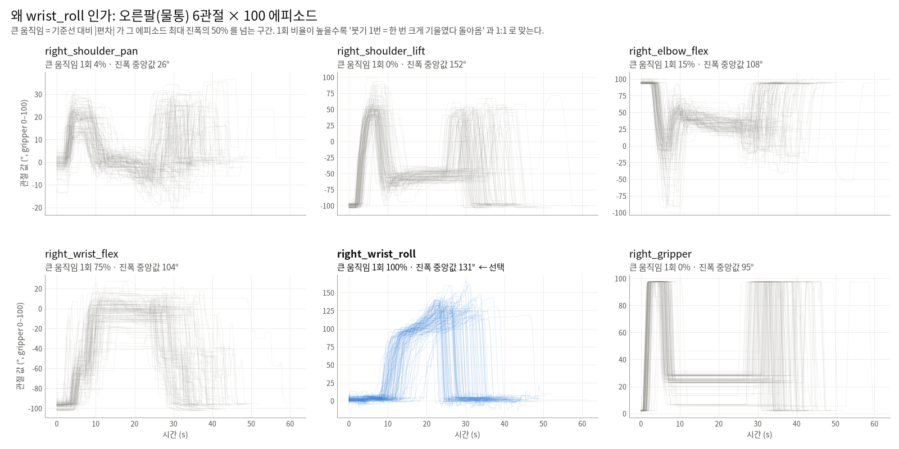
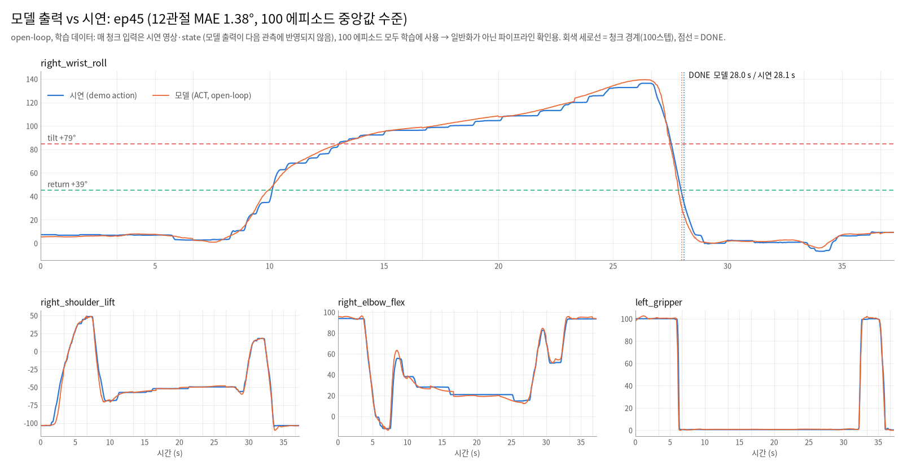
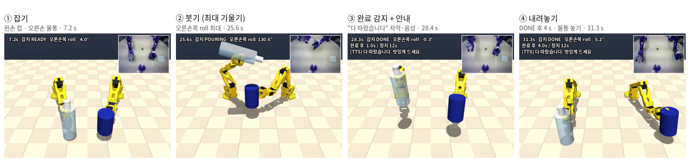

# 설계 노트

결정마다 근거가 된 측정값을 남긴다. 모든 수치는 데이터셋
`UNITAmanipulation/bi_so101_pour_water_20260920_194823`(100 에피소드)과 모델 `act_pour_water_100` 기준이며,
측정 PC 는 GPU 없는 노트북(i5-1335U)이다. 그림은 `python tools/make_figures.py` 로 다시 만든다.

## 1. 완료 감지 — 왜 관절이고, 왜 손목 roll 인가

물은 투명하고 조명에 따라 보이는 모양이 달라 카메라로 수위를 판정하기 불안정하다.
대신 "붓는 동작이 끝났다" 를 관절 상태로 판정한다. 정책 바깥에서 판단하므로 모델을 다시 학습할 필요가 없다.

오른팔(물통) 6관절에서, 기준선(처음 1초 중앙값) 대비 진폭의 50% 를 넘는 큰 움직임이 에피소드당 몇 번 나오는지 셌다.

| 관절 | 진폭 중앙값 | 큰 움직임이 정확히 1번인 에피소드 |
|---|---|---|
| shoulder_pan | 25.8° | 4% |
| shoulder_lift | 152.3° | 0% |
| elbow_flex | 107.8° | 15% |
| wrist_flex | 104.1° | 75% |
| **wrist_roll** | **131.5°** | **100%** |
| gripper | 95.4 | 0% |

손목 roll 은 붓는 구간에만 움직이고(0 → 약 130° 로 천천히 기울였다가 1초 안에 복귀) 나머지 구간에선 거의 그대로다.

**판정 규칙** (`pour_detector.py`)

- 기준선 = 처음 30 프레임(1초) 중앙값
- 기준선 + 78.9° (진폭의 60%) 를 5 프레임 연속 넘으면 **붓는 중**
- 기준선 + 39.4° (30%) 안으로 5 프레임 연속 들어오면 **완료** → TTS 1회
- 진입·복귀 기준선이 다른 히스테리시스: ep31 은 붓는 도중 진입선 근처로 내려왔다 올라가 선을 두 번 넘었지만 오판하지 않았다
- 타임아웃 63 초 (데이터 최대 완료 시점 47.8 초 × 1.3) — 감지 실패 대비 백업

| 항목 | 값 |
|---|---|
| 감지율 (관측 상태 / 시연 명령) | 100/100 · 100/100 |
| 비율 민감도 (진입 40~80%, 복귀 10~50%, 유지 1~15 프레임) | 모든 조합 100/100 |
| 완료 판정 − 최대 기울기 시점 | 중앙 2.4 s |
| 완료 후 에피소드 끝(물통 내려놓기)까지 | 중앙 10.1 s, 최대 15.2 s → 완료 후 12 초 동안 정책 계속 실행 |

새 데이터를 모으면 `python analysis/joint_analysis.py --dataset <경로> --install` 로 임계값을 다시 계산한다.
물통 물 양을 바꿔 가며 모으면 가득 찬 물통은 덜 기울이므로, 감지 못 한 에피소드 목록과 비율별 표를 보고 진입 비율을 고른다.

## 2. 오프라인 모델 검증

데이터셋 프레임(카메라 3대 + 상태)을 모델에 넣어 행동을 뽑고, 그 행동에 감지기를 돌린다(`validate/offline_model.py`).
추론 경로는 LeRobot `SyncInferenceEngine` 과 같다
(`prepare_observation_for_inference` → preprocessor → `predict_action_chunk` → postprocessor).

| 항목 | 값 |
|---|---|
| 모델 행동으로 완료 감지 | 100/100 |
| 완료 시점 차이 \|모델 − 시연\| | 중앙 0.07 s, p90 0.24 s, 최대 0.40 s |
| 행동 오차 (12관절 평균 MAE) | 중앙 1.37°, 최대 2.11° |

**한계:** open-loop(모델 출력이 다음 입력을 바꾸지 않음)이고, 100개 모두 학습 데이터다. 파이프라인 확인이지 일반화 성능이 아니다.

## 3. 청크 경계 튐과 프레임당 제한

ACT 는 한 번 추론에 100 스텝(3.3 초)을 내고 다 쓸 때까지 화면을 다시 보지 않는다(`n_action_steps=100`).
open-loop 검증에서 새 청크로 넘어가는 프레임에 명령이 크게 튀었다.

| | 값 |
|---|---|
| 경계 1,126 곳 중 팔 관절이 10° 넘게 튄 곳 | 14% |
| 20° 넘게 튄 곳 | 3% (최대: 오른 shoulder_lift 69.8°) |
| 시연 데이터의 프레임당 최대 변화 | 약 10° |

| 대응 | 경계 최대 (ep0 / ep1) |
|---|---|
| 그대로 (100 스텝) | 18.3° / 34.1° |
| 50 스텝마다 재추론 | 12.5° / 13.3° |
| 30 스텝마다 재추론 | 11.6° / 12.1° |
| **100 스텝 + 프레임당 10° 제한 (기본값)** | 10.0° / 10.0° (제한 개입 2~3 프레임) |

직전에 보낸 명령 대비 팔 관절 변화를 프레임당 10° 로 자른다(`--max-step-deg`, 그리퍼 제외).
MuJoCo 로 관절을 closed-loop 로 돌리면 경계 튐은 7° 수준이라, open-loop 수치의 상당 부분은
"모델이 실제 상태를 못 보는" 검증 방식 탓으로 보인다. 실물에서 다시 확인한다.

정해진 양만 따르는 동작(수위를 보고 멈춤)은 모델이 화면을 자주 봐야 하므로 `--n-action-steps 10` 같은 짧은 재계획이 필요하고,
그러려면 추론이 한 프레임(33 ms) 안에 끝나는 GPU 가 필요하다 (CPU 0.26 s).

## 4. 음성 — 버튼 없이, 그러나 안전하게

- **듣기:** webrtcvad 로 말소리가 시작되면 녹음, 1초 무음이면 끝. 기다리는 동안에도 키보드 `p`/`s`/`q` 를 받는다.
- **받아쓰기:** Whisper small, `language="ko"`, 명령어 프롬프트 `"물 따라줘. 정지."`, greedy·토큰 상한 48 (환각 반복 시 지연 상한).
- **매칭:** 공백을 지운 텍스트에서 키워드 검색, 정지가 따르기보다 우선("그만 따라" → 정지).
  "나를 따라와", "스토리" 같은 다른 뜻은 제외 목록으로 막는다. Whisper 가 자주 틀리는 형태("정진", "스토")도 정지로 받는다.
- **자기 목소리 오인 방지:** 안내 "물을 따르겠습니다" 에 '따르' 가 들어 있어, 안내 재생이 끝나고 0.3 초 뒤부터만 듣는다.
  소음으로 녹음이 켜져 받아쓴 글자가 없으면 "다시 말씀해 주세요" 를 말하지 않는다.
- **붓는 중 정지는 키보드:** 음성 정지는 인식까지 2~4 초 걸리고, 기울어진 채 멈추면 물이 계속 쏟아진다.

| 합성 음성 122개 (edge-tts 3목소리, 조용/잡음 SNR 10 dB) | 값 |
|---|---|
| 정확도 | 98.4% (120/122) |
| 정지 누락 / 명령 아닌데 따르기 | 0 / 0 |
| 인식 시간 (CPU, 다른 작업 없을 때) | 중앙 약 2.3 s |

합성 음성은 실제 목소리보다 쉽다. 실제 녹음 시험 절차는 [`stt/README.md`](../stt/README.md).
지연이 가끔 10 초 넘게 튀는 건 디코딩이 아니라 같은 PC 의 다른 무거운 작업과의 CPU 경합이었다(같은 클립을 단독으로 돌리면 2~2.5 s).

## 5. TTS — 제어 루프를 막지 않기

고정 문구 6개를 edge-tts(`ko-KR-SunHiNeural`)로 미리 wav 로 만들어 두고(인터넷 1회), 실행 중엔 그 wav 만 `aplay`/`paplay` 로 튼다.
재생은 데몬 스레드 + 큐, 같은 문구 중복은 무시, 완료·정지·타임아웃 안내는 버리지 않는다. 오디오 장치가 없으면 경고 한 번 후 자막만.

| 30 fps 가짜 루프 (데이터셋 재생 2 에피소드, 111.6 s) | 값 |
|---|---|
| 루프 주기 평균 / p99 / 최대 | 33.33 / 35.19 / 38.08 ms |
| 50 ms 넘는 지연 | 0 |
| `say()` 호출 시간 | 최대 0.2 ms |

## 6. MuJoCo 디지털 트윈

공식 [SO-101 MJCF](https://github.com/TheRobotStudio/SO-ARM100)(new calibration, 관절 0 = 범위 중앙)를 `MjSpec` 으로 두 대 붙였다.
LeRobot 의 DEGREES 모드도 0° 가 범위 중앙이라 몸통 관절은 `rad = deg2rad(deg)`, 부호 반전 없음. 그리퍼 0~100 → [-10°, 100°] 선형.
두 팔 간격(0.45 m)·안쪽 회전(30°)은 붓기 정점에서 물통 입구가 컵 위에 오도록 고른 추정값이다.

- 궤적 재생(`sim/play_trajectory.py`): 시연·모델 행동을 겹쳐 보기
- 롤아웃 백엔드 `replay+mujoco`: 카메라는 녹화 영상, 관절 상태는 MuJoCo 가 모델 명령을 따라가 만든 값 (관절만 closed-loop)
- 물리 모드 kp 는 실제 로봇 기록과 가장 비슷했던 17.8

## 7. 오프라인 현장 대비

- `tools/offline_check.py --block-network`: 소켓을 막은 상태에서 정책·체크포인트·wav·Whisper·오디오 장치 확인
- ACT 설정의 `pretrained_backbone_weights=ResNet18_Weights.IMAGENET1K_V1` 때문에 정책 생성 시 torchvision 이 가중치를 내려받으려 해
  캐시가 없으면 오프라인에서 실패한다. 체크포인트가 backbone 까지 덮어쓰므로 `None` 으로 생성해도 출력 차이 0 → 롤아웃 기본값으로 둠
- GTX 1060(Pascal)은 CUDA 12.6 빌드 torch 만 지원 (CUDA 12.8+/13 빌드는 Pascal 제외)

## 8. 시험

| 모듈 | 테스트 |
|---|---|
| tts | 24 — 재생 큐·중복·우선순위, 백엔드 실패 시 자막만, 사용자 문구 |
| stt | 50 — 명령어 매칭(따르기·정지·제외·띄어쓰기), Enter/자동 감지/키보드 흐름, 녹음 도구 |
| sim | 10 — 단위 변환 왕복, 관절 이름, reset/step 범위, 소품 잡기 |

각 모듈 폴더에서 `python -m pytest -q tests`. GitHub Actions 가 push 마다 모듈별 최소 의존성으로 돌린다.
